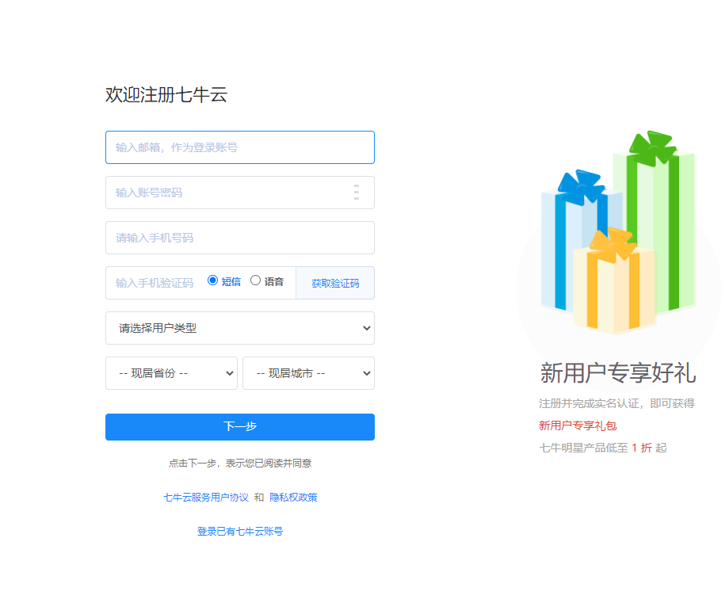
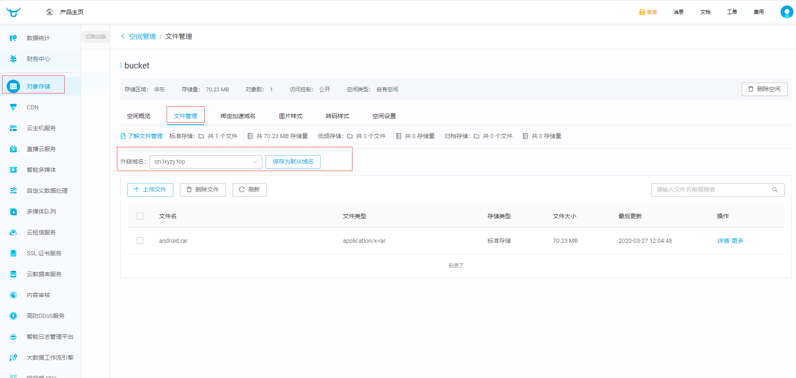
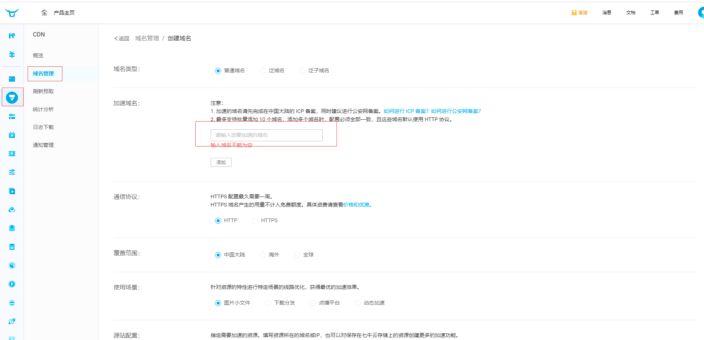
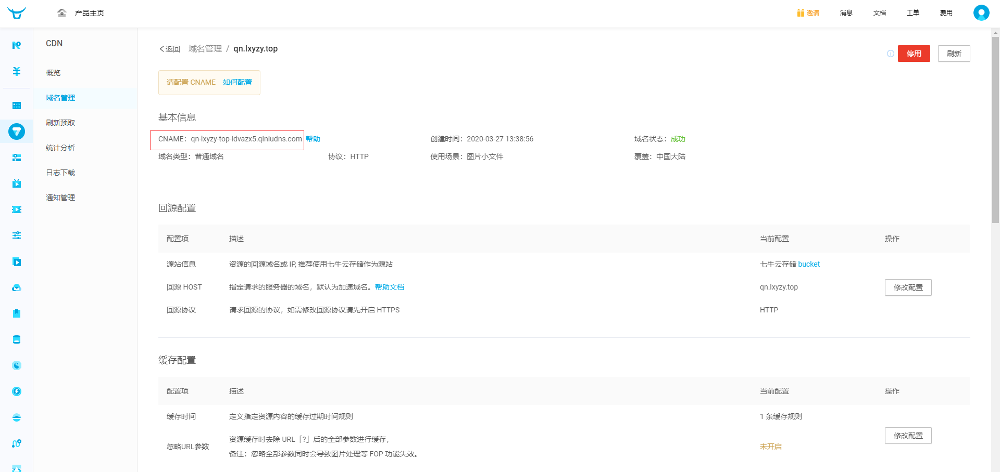
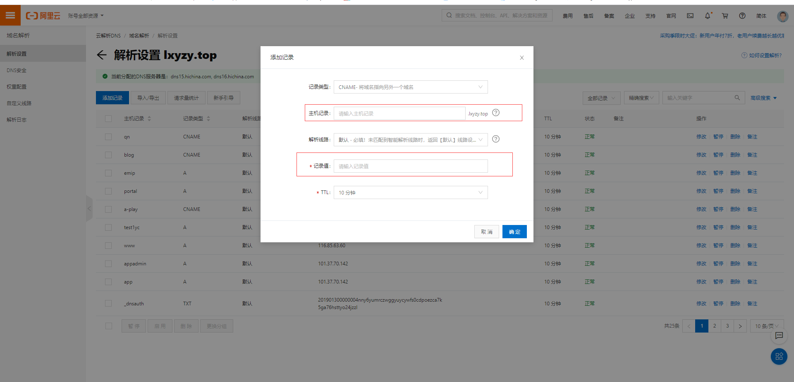
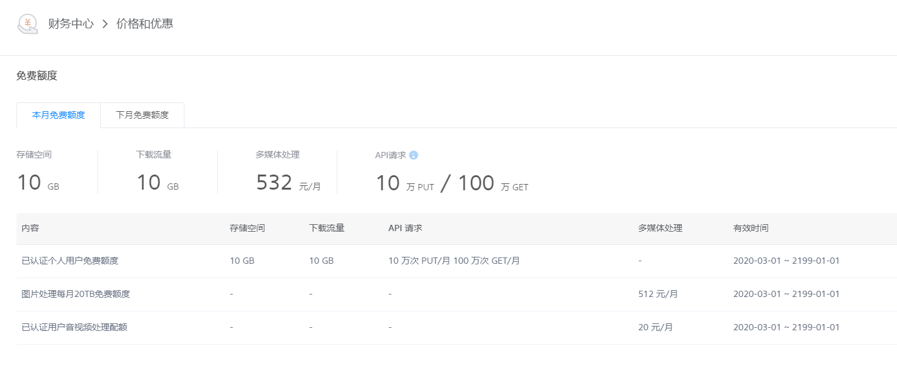

# CDN 配置

`因为博客空间有限，所以使用七牛云存储博客中的附件`

### 七牛云

 - 注册登录
   
   

 - 存储
  
   

  `外联域名即为我们需要配置的域名，只有此外联域名才可以下载文件`   

 - 域名配置  
  
   

   

   `需实名制认证，不然域名配置不成功`   
   `输入的域名即为已认证好的域名，可使用二级域名`

  - 域名解析 
  
      
   
   `记录类型:CHAME` 
   `主机记录:在七牛里面填写的域名`   
   `记录值: 图CHAME中的值`  

   - 免费额度
  
       

